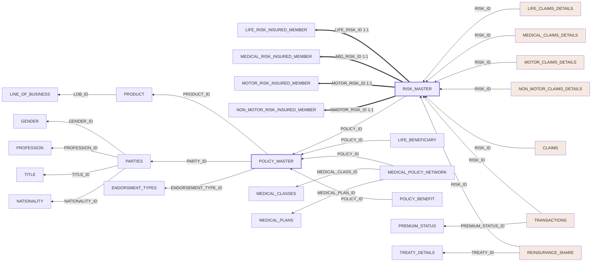

# Relationships

Generated from the `Ref` block of `DWH_Physical_Model_Mix_Prefix_reduced.sql`
(dbdiagram.io DBML). Every endpoint is validated against the deployed GOLD
schema before being written — nothing here is inferred from column names.

| | |
|---|---|
| `Ref` lines parsed | 55 |
| Commented-out `Ref`s skipped | 7 (retired in the source file) |
| Dropped as unmappable | 1 |
| **Active** | **27** |
| Inactive (use `USERELATIONSHIP`) | 27 |

> **Dropped `FK_B_DIM_Parties_REINSU_ID`** — self-referencing — Power BI cannot model a table joined to itself

## The active model

Filter propagation follows the arrows (many → one). Thick arrows are the
one-to-one subtype links. Inactive edges are omitted — they carry no filter
until a measure invokes `USERELATIONSHIP`.

## Why some are inactive

GOLD is a snowflake, not a star: a fact reaches the same dimension by more
than one route. The Tabular engine rejects any **cycle** among active
relationships, so the active set must be a forest. Edges were prioritised by
the design intent stated in the DBML — subtype links and the dimension spine
first, then facts at their **finest grain**. Keeping a fact's `RISK_ID` active
rather than its `POLICY_ID` loses no reach, because the policy is still
reachable through `D_DIM_RISK_MASTER`.

Every inactive edge below still resolves — the **Reachable via** column is the
surviving path. Where that path changes the *meaning* (a role-playing FK such
as `SALES_CHANNEL_ID` is not the same party as the policyholder), the
substitute is **not** equivalent and the edge should be reached explicitly
with `USERELATIONSHIP`. Those rows are flagged ⚠️.

| From | To | Tier | Reachable via |
|---|---|---|---|
| ⚠️ `C_DIM_POLICY_MASTER.CHANNEL_ID` | `B_DIM_PARTIES.PARTY_ID` | policy→party/product spine | C_DIM_POLICY_MASTER → B_DIM_PARTIES |
| ⚠️ `C_DIM_POLICY_MASTER.PARTY_ACCOUNT_ID` | `B_DIM_PARTIES.PARTY_ID` | policy→party/product spine | C_DIM_POLICY_MASTER → B_DIM_PARTIES |
| `E_DIM_LIFE_CLAIMS_DETAILS.POLICY_ID` | `C_DIM_POLICY_MASTER.POLICY_ID` | fact→policy | E_DIM_LIFE_CLAIMS_DETAILS → D_DIM_RISK_MASTER → C_DIM_POLICY_MASTER |
| `E_DIM_MEDICAL_CLAIMS_DETAILS.POLICY_ID` | `C_DIM_POLICY_MASTER.POLICY_ID` | fact→policy | E_DIM_MEDICAL_CLAIMS_DETAILS → D_DIM_RISK_MASTER → C_DIM_POLICY_MASTER |
| `E_DIM_MOTOR_CLAIMS_DETAILS.POLICY_ID` | `C_DIM_POLICY_MASTER.POLICY_ID` | fact→policy | E_DIM_MOTOR_CLAIMS_DETAILS → D_DIM_RISK_MASTER → C_DIM_POLICY_MASTER |
| `E_DIM_NON_MOTOR_CLAIMS_DETAILS.POLICY_ID` | `C_DIM_POLICY_MASTER.POLICY_ID` | fact→policy | E_DIM_NON_MOTOR_CLAIMS_DETAILS → D_DIM_RISK_MASTER → C_DIM_POLICY_MASTER |
| `E_FCT_TRANSACTIONS.POLICY_ID` | `C_DIM_POLICY_MASTER.POLICY_ID` | fact→policy | E_FCT_TRANSACTIONS → D_DIM_RISK_MASTER → C_DIM_POLICY_MASTER |
| `F_FCT_CLAIMS.POLICY_ID` | `C_DIM_POLICY_MASTER.POLICY_ID` | fact→policy | F_FCT_CLAIMS → D_DIM_RISK_MASTER → C_DIM_POLICY_MASTER |
| `G_DIM_REINSURANCE_SHARE.POLICY_ID` | `C_DIM_POLICY_MASTER.POLICY_ID` | fact→policy | G_DIM_REINSURANCE_SHARE → D_DIM_RISK_MASTER → C_DIM_POLICY_MASTER |
| `F_FCT_CLAIMS.CLAIM_ID` | `E_DIM_LIFE_CLAIMS_DETAILS.CLAIM_ID` | natural key | F_FCT_CLAIMS → D_DIM_RISK_MASTER → E_DIM_LIFE_CLAIMS_DETAILS |
| `G_DIM_REINSURANCE_SHARE.TRANSACTION_ID` | `F_FCT_CLAIMS.TRANSACTION_ID` | natural key | G_DIM_REINSURANCE_SHARE → D_DIM_RISK_MASTER → F_FCT_CLAIMS |
| `D_DIM_POLICY_BENEFIT.MEDICAL_CLASS_ID` | `C_DIM_MEDICAL_CLASSES.MEDICAL_CLASS_ID` | natural key | D_DIM_POLICY_BENEFIT → C_DIM_POLICY_MASTER → D_DIM_MEDICAL_POLICY_NETWORK → C_DIM_MEDICAL_CLASSES |
| `D_DIM_POLICY_BENEFIT.MEDICAL_PLAN_ID` | `C_DIM_MEDICAL_PLANS.MEDICAL_PLAN_ID` | natural key | D_DIM_POLICY_BENEFIT → C_DIM_POLICY_MASTER → D_DIM_MEDICAL_POLICY_NETWORK → C_DIM_MEDICAL_PLANS |
| `D_DIM_TREATY_DETAILS.PARTY_ID` | `B_DIM_PARTIES.PARTY_ID` | natural key | D_DIM_TREATY_DETAILS → G_DIM_REINSURANCE_SHARE → D_DIM_RISK_MASTER → C_DIM_POLICY_MASTER → B_DIM_PARTIES |
| `E_FCT_TRANSACTIONS.PARTY_ID` | `B_DIM_PARTIES.PARTY_ID` | natural key | E_FCT_TRANSACTIONS → D_DIM_RISK_MASTER → C_DIM_POLICY_MASTER → B_DIM_PARTIES |
| `G_DIM_REINSURANCE_SHARE.PARTY_ID` | `B_DIM_PARTIES.PARTY_ID` | natural key | G_DIM_REINSURANCE_SHARE → D_DIM_RISK_MASTER → C_DIM_POLICY_MASTER → B_DIM_PARTIES |
| ⚠️ `F_FCT_CLAIMS.CLAIM_DETAIL_ID` | `E_DIM_MOTOR_CLAIMS_DETAILS.MOTOR_CLAIM_DETAIL_ID` | role-playing FK | F_FCT_CLAIMS → D_DIM_RISK_MASTER → E_DIM_MOTOR_CLAIMS_DETAILS |
| ⚠️ `F_FCT_CLAIMS.CLAIM_DETAIL_ID` | `E_DIM_NON_MOTOR_CLAIMS_DETAILS.NMOTOR_CLAIM_DETAIL_ID` | role-playing FK | F_FCT_CLAIMS → D_DIM_RISK_MASTER → E_DIM_NON_MOTOR_CLAIMS_DETAILS |
| ⚠️ `E_DIM_MOTOR_CLAIMS_DETAILS.CLAIMANT_ID` | `B_DIM_PARTIES.PARTY_ID` | role-playing FK | E_DIM_MOTOR_CLAIMS_DETAILS → D_DIM_RISK_MASTER → C_DIM_POLICY_MASTER → B_DIM_PARTIES |
| ⚠️ `E_DIM_NON_MOTOR_CLAIMS_DETAILS.CLAIMANT_ID` | `B_DIM_PARTIES.PARTY_ID` | role-playing FK | E_DIM_NON_MOTOR_CLAIMS_DETAILS → D_DIM_RISK_MASTER → C_DIM_POLICY_MASTER → B_DIM_PARTIES |
| ⚠️ `E_FCT_TRANSACTIONS.BENIFITIONRY_ID` | `B_DIM_PARTIES.PARTY_ID` | role-playing FK | E_FCT_TRANSACTIONS → D_DIM_RISK_MASTER → C_DIM_POLICY_MASTER → B_DIM_PARTIES |
| ⚠️ `E_FCT_TRANSACTIONS.SALES_CHANNEL_ID` | `B_DIM_PARTIES.PARTY_ID` | role-playing FK | E_FCT_TRANSACTIONS → D_DIM_RISK_MASTER → C_DIM_POLICY_MASTER → B_DIM_PARTIES |
| ⚠️ `F_FCT_CLAIMS.CLAIMANT_ID` | `B_DIM_PARTIES.PARTY_ID` | role-playing FK | F_FCT_CLAIMS → D_DIM_RISK_MASTER → C_DIM_POLICY_MASTER → B_DIM_PARTIES |
| `C_DIM_POLICY_MASTER.LOB_ID` | `A_DIM_LINE_OF_BUSINESS.LOB_ID` | conformed reference lookup | C_DIM_POLICY_MASTER → B_DIM_PRODUCT → A_DIM_LINE_OF_BUSINESS |
| `D_DIM_LIFE_BENEFICIARY.NATIONALITY_ID` | `A_REF_NATIONALITY.NATIONALITY_ID` | conformed reference lookup | D_DIM_LIFE_BENEFICIARY → C_DIM_POLICY_MASTER → B_DIM_PARTIES → A_REF_NATIONALITY |
| `D_DIM_MEDICAL_RISK_INSURED_MEMBER.NATIONALITY_ID` | `A_REF_NATIONALITY.NATIONALITY_ID` | conformed reference lookup | D_DIM_MEDICAL_RISK_INSURED_MEMBER → D_DIM_RISK_MASTER → C_DIM_POLICY_MASTER → B_DIM_PARTIES → A_REF_NATIONALITY |
| `D_DIM_TREATY_DETAILS.LOB_ID` | `A_DIM_LINE_OF_BUSINESS.LOB_ID` | conformed reference lookup | D_DIM_TREATY_DETAILS → G_DIM_REINSURANCE_SHARE → D_DIM_RISK_MASTER → C_DIM_POLICY_MASTER → B_DIM_PRODUCT → A_DIM_LINE_OF_BUSINESS |

## Active

| From | To | Tier |
|---|---|---|
| `D_DIM_RISK_MASTER.LIFE_RISK_ID` | `D_DIM_LIFE_RISK_INSURED_MEMBER.LIFE_RISK_ID` | subtype 1:1 (1:1) |
| `D_DIM_RISK_MASTER.MID_RISK_ID` | `D_DIM_MEDICAL_RISK_INSURED_MEMBER.MID_RISK_ID` | subtype 1:1 (1:1) |
| `D_DIM_RISK_MASTER.MOTOR_RISK_ID` | `D_DIM_MOTOR_RISK_INSURED_MEMBER.MOTOR_RISK_ID` | subtype 1:1 (1:1) |
| `D_DIM_RISK_MASTER.NMOTOR_RISK_ID` | `D_DIM_NON_MOTOR_RISK_INSURED_MEMBER.NMOTOR_RISK_ID` | subtype 1:1 (1:1) |
| `D_DIM_RISK_MASTER.POLICY_ID` | `C_DIM_POLICY_MASTER.POLICY_ID` | risk→policy spine |
| `C_DIM_POLICY_MASTER.PRODUCT_ID` | `B_DIM_PRODUCT.PRODUCT_ID` | policy→party/product spine |
| `C_DIM_POLICY_MASTER.PARTY_ID` | `B_DIM_PARTIES.PARTY_ID` | policy→party/product spine |
| `E_DIM_LIFE_CLAIMS_DETAILS.RISK_ID` | `D_DIM_RISK_MASTER.RISK_ID` | fact→risk (finest grain) |
| `E_DIM_MEDICAL_CLAIMS_DETAILS.RISK_ID` | `D_DIM_RISK_MASTER.RISK_ID` | fact→risk (finest grain) |
| `E_DIM_MOTOR_CLAIMS_DETAILS.RISK_ID` | `D_DIM_RISK_MASTER.RISK_ID` | fact→risk (finest grain) |
| `E_DIM_NON_MOTOR_CLAIMS_DETAILS.RISK_ID` | `D_DIM_RISK_MASTER.RISK_ID` | fact→risk (finest grain) |
| `E_FCT_TRANSACTIONS.RISK_ID` | `D_DIM_RISK_MASTER.RISK_ID` | fact→risk (finest grain) |
| `F_FCT_CLAIMS.RISK_ID` | `D_DIM_RISK_MASTER.RISK_ID` | fact→risk (finest grain) |
| `G_DIM_REINSURANCE_SHARE.RISK_ID` | `D_DIM_RISK_MASTER.RISK_ID` | fact→risk (finest grain) |
| `D_DIM_LIFE_BENEFICIARY.POLICY_ID` | `C_DIM_POLICY_MASTER.POLICY_ID` | fact→policy |
| `D_DIM_MEDICAL_POLICY_NETWORK.POLICY_ID` | `C_DIM_POLICY_MASTER.POLICY_ID` | fact→policy |
| `D_DIM_POLICY_BENEFIT.POLICY_ID` | `C_DIM_POLICY_MASTER.POLICY_ID` | fact→policy |
| `G_DIM_REINSURANCE_SHARE.TREATY_ID` | `D_DIM_TREATY_DETAILS.TREATY_ID` | natural key |
| `D_DIM_MEDICAL_POLICY_NETWORK.MEDICAL_CLASS_ID` | `C_DIM_MEDICAL_CLASSES.MEDICAL_CLASS_ID` | natural key |
| `D_DIM_MEDICAL_POLICY_NETWORK.MEDICAL_PLAN_ID` | `C_DIM_MEDICAL_PLANS.MEDICAL_PLAN_ID` | natural key |
| `B_DIM_PARTIES.GENDER_ID` | `A_REF_GENDER.GENDER_ID` | conformed reference lookup |
| `B_DIM_PARTIES.PROFESSION_ID` | `A_REF_PROFESSION.PROFESSION_ID` | conformed reference lookup |
| `B_DIM_PARTIES.TITLE_ID` | `A_REF_TITLE.TITLE_ID` | conformed reference lookup |
| `C_DIM_POLICY_MASTER.ENDORSEMENT_TYPE_ID` | `A_REF_ENDORSMENT_TYPES.ENDORSEMENT_TYPE_ID` | conformed reference lookup |
| `E_FCT_TRANSACTIONS.PREMIUM_STATUS_ID` | `A_REF_PREMUIM_STATUS.PREMIUM_STATUS_ID` | conformed reference lookup |
| `B_DIM_PARTIES.NATIONALITY_ID` | `A_REF_NATIONALITY.NATIONALITY_ID` | conformed reference lookup |
| `B_DIM_PRODUCT.LOB_ID` | `A_DIM_LINE_OF_BUSINESS.LOB_ID` | conformed reference lookup |

## Conformed reference dimensions

The `A_REF_*` tables are shared by several unrelated entities —
`A_REF_NATIONALITY` is referenced by `B_DIM_PARTIES`,
`D_DIM_LIFE_BENEFICIARY` and `D_DIM_MEDICAL_RISK_INSURED_MEMBER`. Only one
of those can be active, or the tiny lookup becomes a *bridge* joining
entities that have nothing to do with each other.

These lookups are therefore ranked **last**, so the real spine claims the
budget first. The consequence is that the non-winning tables cannot be
sliced by that lookup directly.

The clean fix is a **role-playing copy** per consumer — duplicate the small
reference table (931 nationalities, 23 lines of business, 4 genders) so each
entity gets its own. That removes the ambiguity instead of suppressing it,
and at these row counts the cost is nil. The inactive lookups below are the
candidates:

- `C_DIM_POLICY_MASTER.LOB_ID` → `A_DIM_LINE_OF_BUSINESS`
- `D_DIM_LIFE_BENEFICIARY.NATIONALITY_ID` → `A_REF_NATIONALITY`
- `D_DIM_MEDICAL_RISK_INSURED_MEMBER.NATIONALITY_ID` → `A_REF_NATIONALITY`
- `D_DIM_TREATY_DETAILS.LOB_ID` → `A_DIM_LINE_OF_BUSINESS`

## Judgement calls left open

Two edges are real but lose to a higher-priority one, and the substitute is
*related but not identical*. Confirm these with the business:

- `F_FCT_CLAIMS.CLAIM_ID → E_DIM_LIFE_CLAIMS_DETAILS` — substituted by the
  shared-risk path. "Same risk" is not "same claim".
- `G_DIM_REINSURANCE_SHARE.TRANSACTION_ID → F_FCT_CLAIMS` — likewise.

Flipping either is a one-line `isActive` change, as long as the active set
stays acyclic.

## Islands

`A_DIM_DATE`, `A_REF_PLAN_CLASS` and `A_REF_VEHICLE_TYPES` are declared by no
`Ref` — the DBML lists them as islands. `A_DIM_DATE` in particular needs a
deliberate join to the fact date columns before any time intelligence works.

## Do not let Power BI autodetect

The DBML warns that *"BI tools bind on matching column names, so the column
WAS the relationship"* — columns were deleted upstream specifically to stop
spurious joins. Keep **Options → Data Load → Autodetect new relationships**
**off** for this model, or Power BI will re-add the edges the modellers removed.
